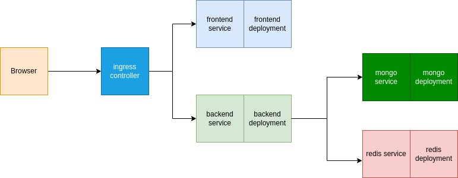

# Table of contents

- [Table of contents](#table-of-contents)
- [Kubernetes Cluster](#kubernetes-cluster)
  - [Overview](#overview)
  - [Requirements](#requirements)
  - [Cluster Diagram](#cluster-diagram)
  - [Create Cluster](#create-cluster)
    - [Using Scripts Inside `scripts` Directory](#using-scripts-inside-scripts-directory)
    - [Manually](#manually)

# Kubernetes Cluster

## Overview

Kubernetes cluster that shows how to deploy and connect Go backend, React frontend, MongoDB, Redis cache with each other.

After running the cluster you can access the frontend by going to [online-judge.io](online-judge.io) in your browser.

## Requirements

1. Minikube
2. Kubectl
3. Docker
4. Git

## Cluster Diagram



## Create Cluster

You can create the cluster:

1. [Using scripts inside `scripts` directory](#using-scripts-inside-`scripts`-directory)
2. [Manually](#manually)

### Using Scripts Inside `scripts` Directory

Run the following command

```bash
bash scripts/init.sh && bash scripts/build-and-push.sh && bash scripts/apply-config-files.sh
```

Explanation:

1. `scripts/init.sh`: starts minikube, enables required addons, runs local container image registry on port `5000`, clones `online-judge-backend`, `online-judge-frontend` repositories if they don't exist
2. `scripts/build-and-push.sh`: builds the required images and pushes them to local container image registry
3. `scripts/apply-config-files.sh`: applies configuration files in `configuration` folder

If you want to delete all created resources by these scripts you can use use the following command `bash scripts/clean.sh`

### Manually

Follow the following steps to create the cluster from scratch using `minikube`, `docker`, `kubectl` and `git`

1. Start minikube

   ```bash
   minikube start
   ```
2. Clone `online-judge-backend`, `online-judge-frontend` repositories if they don't exist
   ``` bash
   [ -d online-judge-frontend ] || git clone https://github.com/OJ-Graduation-Project/online-judge-frontend
   [ -d online-judge-backend ] || git clone https://github.com/OJ-Graduation-Project/online-judge-backend
   ```
3. To make the development process easier **(Optional)**:

   1. Create in-cluster container image registry

      ```bash
      REGISTRY_PORT=5000

      minikube start

      minikube addons enable registry

      kubectl port-forward --namespace kube-system service/registry "$REGISTRY_PORT":80 &

      [ -n "$(docker images -q alpine)" ] || docker pull alpine

      docker run --rm -it --network=host alpine ash -c "apk add socat && socat TCP-LISTEN:$REGISTRY_PORT,reuseaddr,fork TCP:$(minikube ip):$REGISTRY_PORT" 
      ```
   2. Push images to in-cluster registry

      ```bash
      PORT=5000
      BACKEND_IMAGE_TAG="localhost:$PORT/oj-backend"
      FRONTEND_IMAGE_TAG="localhost:$PORT/oj-frontend"

      docker build online-judge-backend -t "$BACKEND_IMAGE_TAG"
      docker push "$BACKEND_IMAGE_TAG"

      docker build online-judge-frontend -t "$FRONTEND_IMAGE_TAG"
      docker push "$FRONTEND_IMAGE_TAG"
      ```
4. Enable ingress addon

   ```bash
   minikube addons enable ingress
   ```
5. Add DNS records of ingress endpoint to `/etc/hosts` file using the following command

   ```bash
   DNS_RECORD="$(minikube ip) online-judge.io"
   HOSTS_PATH="/etc/hosts"

   grep -Fxq "$DNS_RECORD" "$HOSTS_PATH" || echo "$DNS_RECORD" | sudo tee -a "$HOSTS_PATH"
   ```
6. Create the persistent volume, persistent volume claim, config map

   ```bash
   kubectl apply -f configuration/pv-pvc-cm-ingress
   ```
7. Create services, deployments

   ```bash
   kubectl apply -f configuration/service-deployment
   ```
8. View minikube dashboard in the browser **(Optional)**

   ```bash
   minikube dashboard
   ```
9. You can now access the frontend by openning [online-judge.io](http://online-judge.io) in the browser
